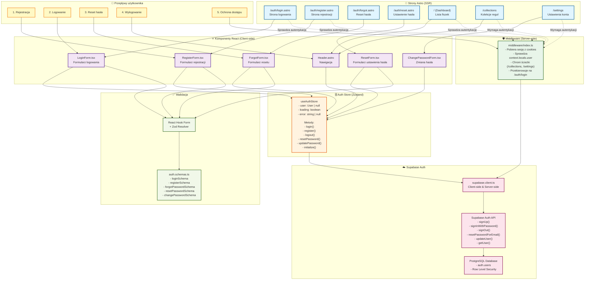

# Diagram przepływu autentykacji

Diagram przedstawia architekturę i przepływy w systemie autentykacji zgodnie z PRD i specyfikacją autentykacji.



## Opis komponentów

### Strony Astro (SSR)

- **`/auth/login.astro`** - Strona logowania, renderuje `LoginForm`
- **`/auth/register.astro`** - Strona rejestracji, renderuje `RegisterForm`
- **`/auth/forgot.astro`** - Strona resetu hasła, renderuje `ForgotForm`
- **`/auth/reset.astro`** - Strona ustawienia nowego hasła, renderuje `ResetForm`
- **`/`** - Dashboard z listą fiszek (dostępny bez logowania dla fiszek ad-hoc)
- **`/collections`** - Kolekcje reguł (wymaga autentykacji)
- **`/settings`** - Ustawienia konta (wymaga autentykacji)

### Komponenty React (Client-side)

- **`LoginForm.tsx`** - Formularz logowania z walidacją (email, password)
- **`RegisterForm.tsx`** - Formularz rejestracji z walidacją (email, password, confirm)
- **`ForgotForm.tsx`** - Formularz resetu hasła (email)
- **`ResetForm.tsx`** - Formularz ustawienia nowego hasła (password, confirm)
- **`ChangePasswordForm.tsx`** - Formularz zmiany hasła w ustawieniach (current, new, confirm)
- **`Header.astro`** - Nagłówek z przyciskami logowania/wylogowania

### Auth Store (Zustand)

- **`useAuthStore`** - Globalny store zarządzający stanem autentykacji
  - Stan: `user`, `loading`, `error`
  - Metody: `login()`, `register()`, `logout()`, `resetPassword()`, `updatePassword()`, `initialize()`
  - Mapowanie błędów Supabase na polskie komunikaty

### Middleware (Server-side)

- **`middleware/index.ts`** - Middleware Astro
  - Pobiera sesję użytkownika z cookies
  - Sprawdza `context.locals.user`
  - Chroni ścieżki wymagające autentykacji (`/collections`, `/settings`)
  - Przekierowuje na `/auth/login?redirect=...` jeśli brak autentykacji

### Supabase

- **`supabase.client.ts`** - Klient Supabase (client-side i server-side)
- **Supabase Auth API** - Operacje autentykacji
- **PostgreSQL Database** - Baza danych z RLS (Row Level Security)

### Walidacja

- **`auth.schemas.ts`** - Schematy Zod dla wszystkich formularzy
- **React Hook Form** - Zarządzanie formularzami z integracją Zod

## Przepływy użytkownika

### 1. Rejestracja (US-001)

```
Użytkownik → /auth/register → RegisterForm → useAuthStore.register()
→ Supabase Auth.signUp() → Email confirmation (opcjonalnie)
→ Auto-login lub komunikat → Redirect do /
```

### 2. Logowanie (US-002)

```
Użytkownik → /auth/login → LoginForm → useAuthStore.login()
→ Supabase Auth.signInWithPassword() → JWT token w cookies
→ useAuthStore.user = user → Redirect do / lub redirect param
```

### 3. Reset hasła (US-006)

```
Użytkownik → /auth/forgot → ForgotForm → useAuthStore.resetPassword()
→ Supabase Auth.resetPasswordForEmail() → Email z linkiem
→ /auth/reset#token → ResetForm → useAuthStore.updatePassword()
→ Supabase Auth.updateUser() → Redirect do /auth/login
```

### 4. Wylogowanie (US-005)

```
Użytkownik → Header → useAuthStore.logout()
→ Supabase Auth.signOut() → Clear cookies → useAuthStore.user = null
→ Redirect do /auth/login
```

### 5. Ochrona dostępu (US-003, US-004)

```
Użytkownik → /collections (bez logowania) → Middleware sprawdza user
→ Brak user → Redirect do /auth/login?redirect=/collections
→ Po zalogowaniu → Redirect do /collections
```

## Bezpieczeństwo

- **Rate Limiting**: Logowanie (5 prób/min), Reset (3 próby/godz)
- **Brute Force Protection**: Automatyczna blokada przez Supabase
- **XSS Protection**: Sanityzacja przez React i Shadcn/ui
- **CSRF Protection**: Cookies z `SameSite=Strict`
- **JWT Tokens**: Przechowywane w httpOnly cookies
- **Row Level Security**: Izolacja danych użytkowników w Supabase

## Zgodność z PRD

Diagram pokrywa następujące wymagania z PRD:

- **US-001**: Rejestracja konta ✅
- **US-002**: Logowanie do aplikacji ✅
- **US-003**: Kolekcje reguł (wymagają autentykacji) ✅
- **US-004**: Bezpieczny dostęp i uwierzytelnianie ✅
- **US-005**: Wylogowanie z aplikacji ✅
- **US-006**: Reset zapomnianego hasła ✅
- **US-007**: Zmiana hasła w ustawieniach konta ✅
- **US-008**: Usunięcie konta i danych (wymaga endpointu API) ⚠️
- **US-020**: Przegląd i edycja ustawień konta ✅
